<div align="center">


# **EdgeCart**
## Predictive Waste Intelligence System

*Sometimes sustainability isn't about doing something grand—it's about starting small.*

**We're tackling food waste, one produce shelf at a time.**

[](https://hackprinceton.com)
[](https://knotapi.com)
[](https://x.ai)

### **🔧 Technology Stack**

[](https://python.org)
[](https://flask.palletsprojects.com)
[](https://pytorch.org)
[](https://react.dev)
[](https://www.typescriptlang.org)

[](https://github.com/ultralytics/ultralytics)
[](https://opencv.org)
[](https://ai.google.dev)
[](https://developer.mozilla.org/en-US/docs/Web/API/WebSockets_API)
[](https://www.sqlite.org)

</div>

---

## 🌍 The Problem

Every year, **40% of food in America goes to waste**—that's $408 billion worth of food thrown away. Meanwhile:
- Grocery stores lose money on expired produce
- Customers miss out on deals on perfectly good food
- Our planet suffers from unnecessary environmental impact

The current approach? Random discounts, generic sales, and hoping someone buys it. **It doesn't work.**

---

## 💡 The EdgeCart Solution

We're bringing **intelligence to the edge** of the supply chain—right where food meets shelf.

### **How It Works**

#### 1. **🎥 Smart Camera Surveillance**
Cameras point directly at produce shelves, continuously monitoring fruits, vegetables, and perishables in real-time using:
- **YOLO object detection** to identify what's on the shelf
- **ResNet freshness model** scoring items from 100 (just arrived) to 0 (spoiled)
- **Gemini blemish detection** for precise quality assessment

Our AI detects visual changes—browning bananas, soft spots on tomatoes, wilting lettuce—creating a **real-time decay map** of all inventory.

#### 2. **🔗 Customer Intelligence via Knot API**
Customers download our app and connect their bank/cards through **Knot API**, which reveals:
- Complete purchase history across all grocery stores
- What they buy, how often, from which stores
- Price sensitivity and spending patterns

The system learns: *"User A buys avocados 2x per week, always organic, usually spends $3-4 each"* and *"User B bought strawberries 5 times last month, only when under $5."*

#### 3. **🎯 Smart Matching in Real-Time**
When cameras detect produce entering the "risky" freshness zone (70% freshness, 12 hours until spoilage):
1. AI automatically calculates dynamic discounts (lower freshness = deeper discount)
2. System identifies customers who **actually buy** that item
3. Push notification: *"Your favorite organic avocados now 40% off at Store X, perfect ripeness for tonight!"*

**No spam. No random deals. Only relevant offers for groceries you were already going to buy.**

#### 4. **🤖 AI-Powered Recommendations (xAI Grok)**
Our recommendation engine powered by **xAI's Grok** analyzes:
- **Purchase Pattern Analysis** - When are they due for their next shopping trip?
- **Timing Relevance** - Weekend bulk buyers vs. weekday shoppers
- **Value Perception** - Does the discount exceed their usual threshold?
- **Behavioral Triggers** - Seasonal preferences, health choices, new varieties
- **Urgency Factors** - Limited quantity, time sensitivity, expiration proximity

Example reasoning: *"Perfect for meal prep Sunday - matches weekly buying pattern, 30% discount exceeds usual 20% threshold, last purchased 8 days ago (usual cycle: 10 days)"*

#### 5. **📊 Predictive Analytics for Stores**
Store dashboard provides actionable insights:
- *"Based on current decay rates and customer buying patterns, reduce next banana order by 30%"*
- *"Your avocado customers also shop at Whole Foods - stock more organic"*
- *"50 customers notified about strawberries but only 10 bought - discount wasn't deep enough"*

#### 6. **🌱 Zero-Waste Fallback**
For items that won't sell even with targeted discounts:
- System auto-schedules food bank donations 12 hours before critical decay
- Customers who referred the food bank earn "waste warrior" points
- Community impact tracking shows pounds of food saved

#### 7. **💬 Natural Language Insights (xAI Grok)**
Everything is queryable:
- **Stores ask:** *"Which products have the worst sell-through rate at 60% freshness?"*
- **Customers ask:** *"How much could I save monthly based on my shopping patterns?"*
- Instant AI-powered insights with context

---

## 🏗️ System Architecture

### **High-Level Component Diagram**

```mermaid
graph TB
    subgraph "Edge Layer"
        CAM[📹 Smart Cameras<br/>YOLO + ResNet + Gemini]
    end
    
    subgraph "Backend Services"
        API[🔧 Flask API<br/>REST + WebSocket]
        DB[(🗄️ SQLite DB<br/>Inventory + Customers)]
        AI[🤖 xAI Grok<br/>Recommendation Engine]
    end
    
    subgraph "External APIs"
        KNOT[🔗 Knot API<br/>Purchase History]
    end
    
    subgraph "User Interfaces"
        ADMIN[👨‍💼 Admin Dashboard<br/>React + TypeScript]
        CUSTOMER[👤 Customer Portal<br/>React + TypeScript]
    end
    
    CAM -->|Real-time Detection| API
    API <-->|Store/Query| DB
    API <-->|Get Recommendations| AI
    API <-->|Sync Purchase Data| KNOT
    API <-->|WebSocket Updates| ADMIN
    API <-->|WebSocket Notifications| CUSTOMER
    
    style CAM fill:#4ade80,stroke:#22c55e,color:#000
    style API fill:#60a5fa,stroke:#3b82f6,color:#000
    style DB fill:#a78bfa,stroke:#8b5cf6,color:#000
    style AI fill:#fbbf24,stroke:#f59e0b,color:#000
    style KNOT fill:#fb923c,stroke:#f97316,color:#000
    style ADMIN fill:#ec4899,stroke:#db2777,color:#000
    style CUSTOMER fill:#06b6d4,stroke:#0891b2,color:#000
```



### **Data Flow: From Detection to Customer Notification**

```mermaid
sequenceDiagram
    participant Camera as 📹 Smart Camera
    participant API as 🔧 Backend API
    participant DB as 🗄️ Database
    participant Grok as 🤖 xAI Grok
    participant Knot as 🔗 Knot API
    participant Customer as 👤 Customer App
    
    Camera->>API: Detect banana @ 65% freshness
    API->>DB: Update freshness score
    API->>DB: Calculate discount (35% off)
    
    alt Discount >= 20%
        API->>DB: Query customers
        API->>Knot: Fetch purchase patterns
        Knot-->>API: Sarah buys bananas weekly
        
        API->>Grok: Analyze match quality
        Grok-->>API: Priority: 92 (Perfect match)
        
        API->>DB: Create recommendation
        API->>Customer: 🔔 Push notification
        Customer-->>API: View notification
        API->>DB: Mark as viewed
    end
    
    Note over Camera,Customer: Real-time processing: ~2-3 seconds
```



### **AI/ML Pipeline Architecture**

```mermaid
flowchart LR
    subgraph "Computer Vision Pipeline"
        IMG[📸 Camera Frame] --> YOLO[YOLO v8<br/>Object Detection]
        YOLO --> CROP[Crop Objects]
        CROP --> RESNET[ResNet18<br/>Freshness 0-100]
        CROP --> GEMINI[Gemini Robotics<br/>Blemish Detection]
    end
    
    subgraph "Decision Engine"
        RESNET --> SCORE[Freshness Score]
        GEMINI --> BLEMISH[Blemish Count]
        SCORE --> DISCOUNT[Calculate<br/>Dynamic Discount]
        BLEMISH --> DISCOUNT
    end
    
    subgraph "Recommendation AI"
        DISCOUNT --> FILTER{Discount<br/>>= 20%?}
        FILTER -->|Yes| GROK[xAI Grok<br/>Match Customers]
        FILTER -->|No| SKIP[Skip]
        GROK --> NOTIFY[Push Notification]
    end
    
    style IMG fill:#4ade80,stroke:#22c55e
    style YOLO fill:#60a5fa,stroke:#3b82f6
    style RESNET fill:#a78bfa,stroke:#8b5cf6
    style GEMINI fill:#fbbf24,stroke:#f59e0b
    style GROK fill:#fb923c,stroke:#f97316
    style NOTIFY fill:#ec4899,stroke:#db2777
```



### **Customer Journey Map**


### **Technology Stack Visualization**


---

## 🎯 The Impact

### **For Stores**
- ✅ Reduce food waste by 30-50%
- ✅ Recover revenue from inventory that would expire
- ✅ Better inventory forecasting based on actual customer demand
- ✅ Turn waste into profit

### **For Customers**
- ✅ Save 30-50% on groceries they already buy
- ✅ Get notified only about items they actually want
- ✅ Buy produce at optimal ripeness for their needs
- ✅ Feel good about reducing waste

### **For the Planet**
- 🌍 Less food in landfills = reduced methane emissions
- 💧 Conserve water used to grow wasted food
- 🌱 More efficient food supply chain
- ♻️ Circular economy approach to grocery retail

---

## 🛠️ Technology Stack

### **Backend** (Python)
- **Flask** - REST API & WebSocket server
- **Flask-SQLA** - Database ORM
- **OpenCV + YOLO** - Real-time object detection
- **PyTorch + ResNet** - Freshness classification model
- **Google Gemini** - Blemish segmentation & detection
- **Knot API** - Customer purchase data integration
- **xAI Grok** - AI-powered recommendation engine
- **SQLite/PostgreSQL** - Database

### **Frontend** (React + TypeScript)
- **React** - Modern component-based UI
- **WebSocket** - Real-time updates
- **Framer Motion** - Smooth animations
- **Custom Terminal UI** - Cyberpunk aesthetic

### **AI/ML Models**
1. **YOLOv8** - Object detection for identifying produce
2. **ResNet18** - Transfer learning for fresh/rotten classification
3. **Gemini Robotics** - High-precision blemish detection
4. **xAI Grok** - Natural language recommendations

---

## 🚀 Quick Start

### **Prerequisites**
```bash
# Python 3.11+
python --version

# Node.js 18+
node --version
```

### **Backend Setup**
```bash
cd backend

# Create virtual environment
python -m venv venv
source venv/bin/activate  # On Windows: venv\Scripts\activate

# Install dependencies
pip install -r requirements.txt

# Set up environment variables
cp .env.example .env
# Edit .env with your API keys:
# - KNOT_CLIENT_ID (from Knot)
# - KNOT_SECRET (from Knot)
# - XAI_API_KEY (from xAI)
# - GEMINI_API_KEY (from Google)

# Initialize database with sample data
POPULATE=true python main.py
```

### **Frontend Setup**
```bash
cd frontend

# Install dependencies
npm install

# Start development server
npm run dev
```

### **Access the System**
- **Admin Dashboard:** http://localhost:5173
- **Customer Portal:** http://localhost:5173/#/customer
- **Backend API:** http://localhost:3000

---

## 📸 Demo Users

Try these pre-loaded customer profiles (no Knot API key needed):

### **Sarah Chen** (@abc)
*Health-conscious mom who loves organic berries*
- Buys strawberries, blueberries, spinach regularly
- Shops at Instacart and Whole Foods
- Average spend: $45-50 per trip

### **Marcus Lee** (@def)
*Fitness enthusiast buying citrus for smoothies*
- Buys oranges, grapefruits, kale 2x per week
- Shops at Walmart and Target
- Average spend: $22-35 per trip

### **Emily Rodriguez** (@ghi)
*Foodie exploring exotic fruits*
- Buys grapes, dragon fruit, kiwi occasionally
- Shops at specialty stores
- Average spend: $30-40 per trip

---

## 🎥 Features

### **Admin Dashboard**
- 📹 **Live Camera Feed** with real-time fruit detection
- 📊 **Inventory Management** with freshness scores
- 🎨 **Blemish Detection** with visual highlighting
- 📈 **Analytics** - Waste prevention metrics
- 🔔 **WebSocket Updates** - Real-time inventory changes
- 📉 **Predictive Ordering** - AI-suggested inventory adjustments

### **Customer Portal**
- 🛒 **Personalized Deals** based on Knot purchase history
- 🔔 **Smart Notifications** via WebSocket (only relevant items)
- 📜 **Purchase History** from both Knot and EdgeCart
- 💰 **Savings Tracker** showing total money saved
- 🌍 **Impact Dashboard** showing food waste prevented
- 🎯 **AI Reasoning** explains why each deal was recommended

### **AI Recommendation Engine**
- 🧠 **Multi-dimensional Analysis** (timing, value, behavior, urgency)
- 🎯 **Priority Scoring** (80-100 for perfect matches)
- 📖 **Natural Language Reasoning** for each recommendation
- ⚡ **Rate-Limited** to optimize API costs (10s between calls)
- 🔄 **Feedback Loop** learns from customer responses

---

## 📊 Database Schema

```
stores                 fruit_inventory           freshness_status
- id                   - id                      - id
- name                 - store_id                - inventory_id
- location             - fruit_type              - freshness_score (0-1.0)
                       - quantity                - predicted_expiry_date
                       - original_price          - discount_percentage
                       - current_price           - status (fresh/ripe/clearance)
                       - thumbnail_path          - last_checked

customers              purchase_history          recommendations
- id                   - id                      - id
- knot_customer_id     - customer_id             - customer_id
- name                 - inventory_id            - inventory_id
- email                - quantity                - priority_score
- preferences (JSON)   - price_paid              - reason (JSON)
                       - discount_applied        - viewed
                       - knot_transaction_id     - purchased

quantity_change_log    waste_log
- id                   - id
- inventory_id         - inventory_id
- old_quantity         - quantity_wasted
- new_quantity         - estimated_value_loss
- change_type          - reason
- freshness_score      - logged_at
```

---

## 🔐 Environment Variables

Create a `.env` file in the `backend/` directory:

```bash
# Knot API (for customer data)
KNOT_CLIENT_ID=your_knot_client_id
KNOT_SECRET=your_knot_secret
KNOT_ENV=tunnel  # tunnel, dev, or prod
KNOT_USE_REAL=true

# xAI (for AI recommendations)
XAI_API_KEY=your_xai_api_key

# Google Gemini (for blemish detection)
GEMINI_API_KEY=your_gemini_api_key

# Database
DATABASE_URL=sqlite:///edgecart.db

# Server
PORT=3000
POPULATE=true  # Seed with sample data on first run
```

---

## 📜 License

MIT License - See [LICENSE](LICENSE) file for details

---